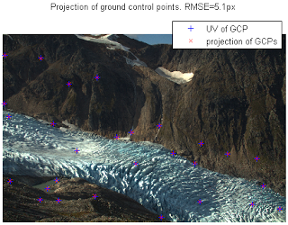

## Camera.m


The camera model holds both all the internal camera parameters (focal lengths, distortion coefficients, etc) and all the external camera parameters (camera location and view direction). This class can be used to project back and forth between pixel and world coordinates once the camera parameters have been specified. It can also be used to calibrate the camera parameters given a set of ground control points.

A good example of how the camera class is used can be found in the [Engabreen](demoengabreen.md) example.

``` 
   imgsz   - size of image in pixels [#rows, #columns]  camera properties:
   f       - focal length in pixel units (two element vector [fx,fy])
   c       - camera center in pixel coordinates (two element vector: [cx,cy])
   k       - radial distortion coefficients. (six element vector: [k1-k6])
   p       - tangential distortion coefficients (two element vector: [p1,p2])
   xyz     - world coordinates of camera.
   viewdir - [yaw,pitch,roll]. Yaw: rotation about z (0=looking east)
                               Pitch: look up/down angle
                               Roll: camera roll (horizon tilt).
 
  camera Dependent/derived properties:
   (i.e. properties calculated from the camera parameters)
   R         - camera rotation matrix calculated from camera view
               direction (read only)
   fullmodel - a 20-element vector containing all camera properties.
               [camx,camy,camz,imgszy,imgszx,viewdiryaw,viewdirpitch,viewdirroll,fx,fy,cx,cy,k1-6,p1-2]
 
  camera Methods:
   camera      - constructor
   optimizecam - optimize the camera to mimimize misfit between
                 projected world coordinates and pixel coordinates.
   project     - project world coordinates to image coordinates (3d->2d)
   invproject  - project image coordinates to world coordinates (2d->3d)
```


## Setting up camera parameters

You setup the camera parameters using its contructor and then you can modify the parameters afterwards. E.g. like this:

```matlab
cam=camera([446722 7396671 770]) %specifying world coordinates only
cam.f=[6000 6000];
cam.viewdir=[90 0 0]*pi/180; %looking north
```

The [Engabreen](demoengabreen.md) and [Schneefernerkopf](demoschneeferner.md) examples show some practical use cases. There are additional ways the constructor can be called. Type "help camera.camera" on the matlab prompt to see the full help of the constructor. 

## Calibrating camera parameters from ground control points
The camera class contains an optimizeCam method which can be used to calibrate the camera and also determine the external camera parameters. You give it a set of ground control points. I.e. a set of 3d world coordinates and corresponding pixel coordinates. OptimizeCam will then work to minimize the misfit between the projected 3d points and the pixel coordinates. You can specify which parameters which are free in the optimization. 

```matlab
[newcamera,rmse,AIC] = cam.optimizecam(worldcoordinates,pixelcoordinates,'00000111000000000000')
```

In this case the string '00000111000000000000' says that the 6,7,8th parameters should be free. The ordering here refers to the ordering in the "fullmodel" where 6-8 corresponds to the three view direction angle. So, in this case we are only optimizing the view direction of the camera. 

The [Engabreen](demoengabreen.md) and [Schneefernerkopf](demoschneeferner.md) examples show how a simple radial distortion model is determined from the ground control points. Type "help camera.optimizeCam" on the matlab prompt for more details on how to use it. 

Projecting from world coordinates to image coordinates (3d to 2d)
The project method makes it simple to project from world coordinates to pixel coordinates.
```matlab
 [uv,~,inframe]=cam.project(xyz)
```
Here uv are the projected pixel coordinates. inframe is a boolean array which is true if the projected point is within the frame of the image. 



See the [Schneefernerkopf](demoschneeferner.md) example for a simple example how it can be used.
Projecting from image coordinates to world coordinates (2d to 3d)
Projecting from 2d to 3d can also be considered raytracing conceptually. Usually you want to find the point on a DEM, that corresponds to the pixel coordinates after projection. You can do this with invproject . 

```matlab
xyz=cam.invproject(uv,demX,demY,demZ)
```

The [Engabreen example](demoengabreen.md) shows how this can be used in practice. Type "help camera.invproject" on the matlab prompt for more details on how to use it. 
How do you calculate the focal length in pixel units from the camera specifications?
The focal length from the manufacturer alone does not determine the field of view / zoom level of a lens. The focal length in mm together with sensor size and image size determines the field of view that the lens is able to see. The camera needs the focal length in pixel units. These can be calculated thus:

```matlab
FocalLength=30; %mm (as per lens specifications)
SensorSize=[22.0 14.8]; %mm (this is the physical size of the sensor in the camera. It will depend on model.)
imgsz=size(A);
f=imgsz([2 1]).*(FocalLength./SensorSize);
```
