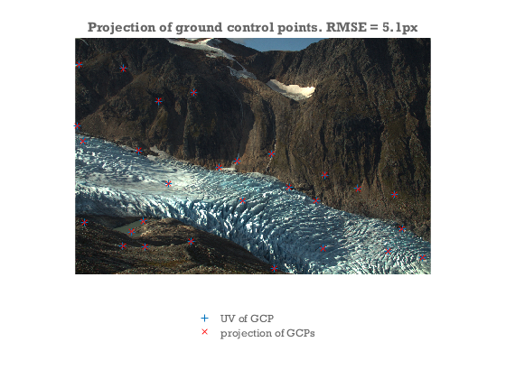
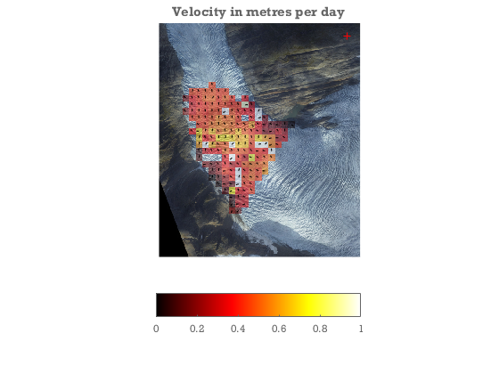
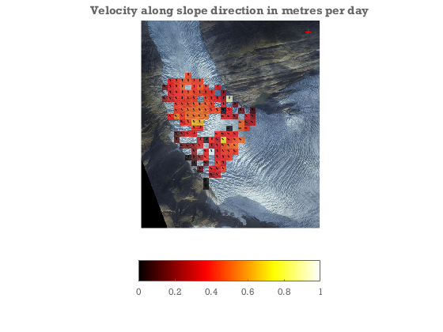

Feature tracking example
----------------------------------------------------------

This is a complete example of feature tracking on Engabreen.

   + Load images & data
   + Use GCPs to determine camera view direction and lens distortion   parameters of image
   + track stable rock features to determine camera shake and infer view direction   of image B
   + Pre-process DEM by filling crevasses.
   + Track ice motion between images
   + Georeference tracked points and calculate real world velocities.
```matlab
close all
```


Setup file locations and load images & data
----------------------------------------------------------

```matlab
idA = 8902; idB = 8937; % image ids (/file numbers)

datafolder = 'demos';
fA = fullfile(datafolder,sprintf('IMG_%4.0f.jpg',idA));
fB = fullfile(datafolder,sprintf('IMG_%4.0f.jpg',idB));

%load images:
A = imread(fA);
B = imread(fB);

metaA = imfinfo(fA);tA = datenum(metaA.DateTime,'yyyy:mm:dd HH:MM:SS');
metaB = imfinfo(fB);tB = datenum(metaB.DateTime,'yyyy:mm:dd HH:MM:SS');

dem = load(fullfile(datafolder,'dem')); %load DEM
gcpA = load(fullfile(datafolder,'gcp8902.txt'));%load ground control points for image A
```


Determine camera parameters for image A
----------------------------------------------------------

   + Initial crude guess at camera parameters
   + Use GCPs to optimize camera parameters
```matlab
%calculate focal length in pixel units:
FocalLength = 30; %mm (can also be found here: metaA.DigitalCamera.FocalLength)
SensorSize = [22.0 14.7]; %mm: http://www.cnet.com/products/canon-eos-rebel-t3/specs/
imgsz = size(A);
f = imgsz([2 1]).*(FocalLength./SensorSize);

%known camera location:
cameralocation = [446722.0 7396671.0 770.0];

%crude estimate of look direction.
camA = camera(cameralocation,size(A),[200 0 0]*pi/180,f); %loooking west

%Use GCPs to optimize the following camera parameters:
%view dir, focal lengths, and a simple radial distortion model
[camA,rmse,aic] = camA.optimizecam(gcpA(:,1:3),gcpA(:,4:5),'00000111110010000000');
fprintf('reprojectionerror = %3.1fpx  AIC:%4.0f\n',rmse,aic)

%Visually compare the projection of the GCPs with the pixel coords:
figure
axes('position',[0 .1 1 .8]); hold on
image(A)
axis equal off ij tight
hold on
uv = camA.project(gcpA(:,1:3));
h = plot(gcpA(:,4),gcpA(:,5),'+',uv(:,1),uv(:,2),'rx');
legend(h,'UV of GCP','projection of GCPs','location','southoutside')
title(sprintf('Projection of ground control points. RMSE = %.1fpx',rmse))
```

```
reprojectionerror = 5.1px  AIC: 155

```
    



Determine view direction of camera B.
----------------------------------------------------------

   + find movement of rock features between images A and B
   + determine camera B by pertubing viewdir of camera A.
```matlab
% First get an approximate estimate of the image shift using a single large
% template
[duoffset,dvoffset] = templatematch(A,B,3000,995,'templatewidth',261,'searchwidth',400,'supersample',0.5,'showprogress',false)

% Get a whole bunch of image shift estimates using a grid of probe points.
% Having multiple shift estimates will allow us to determine camera
% rotation.
[pu,pv] = meshgrid(200:700:4000,100:400:1000);
pu = pu(:); pv = pv(:)+pu/10;

[du,dv,C] = templatematch(A,B,pu,pv,'templatewidth',61,'searchwidth',81,'supersample',3,'initialdu',duoffset,'initialdv',dvoffset);


% Determine camera rotation between A and B from the set of image
% shifts.

% find 3d coords consistent with the 2d pixel coords in points.
xyz = camA.invproject([pu pv]);
% the projection of xyz has to match the shifted coords in points+dxy:

[camB,rmse] = camA.optimizecam(xyz,[pu+du pv+dv],'00000111000000000000'); %optimize 3 view direction angles to determine camera B.
rmse

%quantify the shift between A and B in terms of an delta angle.
DeltaViewDirection = (camB.viewdir-camA.viewdir)*180/pi
```

```
duoffset =
       13.679
dvoffset =
       -1.244
rmse =
       0.4059
DeltaViewDirection =
      0.12633     0.017584     0.015242

```
    

Generate a set of points to be tracked between images
----------------------------------------------------------

   + Generate a regular grid of candidate points in world coordinates.
   + Cull the set of candidate points to those that are visible and glaciated
```matlab
% The viewshed is all the points of the dem that are visible from the
% camera location. They may not be in the field of view of the lens.
dem.visible = voxelviewshed(dem.X,dem.Y,dem.filled,camA.xyz);

%Make a regular 50 m grid of points we would like to track from image A
[XA,YA] = meshgrid(min(dem.x):50:max(dem.x),min(dem.y):50:max(dem.y));
ZA = interp2(dem.X,dem.Y,dem.filled,XA,YA);

%Figure out which pixel coordinates they correspond to:
[uvA,~,inframe] = camA.project([XA(:) YA(:) ZA(:)]); %where would the candidate points be in image A

%Insert nans where we do not want to track:
keepers = double(dem.visible&dem.mask); %visible & glaciated dem points
keepers = filter2(ones(11)/(11^2),keepers); %throw away points close to the edge of visibility
keepers = interp2(dem.X,dem.Y,keepers,X(:),Y(:))>.99; %which candidate points fullfill the criteria.
uvA(~(keepers&inframe)) = nan;
```


Track points between images.
----------------------------------------------------------

```matlab
% calculate where points would be in image B if no ice motion
% ( i.e. accounting only for camera shake)
camshake = camB.project(camA.invproject(uvA))-uvA;

options = [];
options.pu = uvA(:,1);
options.pv = uvA(:,2);
options.method = 'OC';
options.showprogress = true;
options.searchwidth = 81;
options.templatewidth = 21;
options.supersample = 2; %supersample the input images for better subpixel estimation
options.initialdu = camshake(:,1);
options.initialdv = camshake(:,2);

[du,dv,C,Cnoise] = templatematch(A,B,options);

uvB = uvA+[du dv];

signal2noise = C./Cnoise;
```


Georeference tracked points
----------------------------------------------------------

... and calculate velocities

```matlab
xyzA = camA.invproject(uvA,dem.X,dem.Y,dem.filled); % has to be recalculated because uvA has been rounded.
xyzB = camB.invproject(uvB,dem.X,dem.Y,dem.filled-dem.mask*22.75*(tB-tA)/365); % impose a thinning of the DEM of 23m/yr between images.
V = (xyzB-xyzA)./(tB-tA); % 3d velocity.

Vx = reshape(V(:,1),size(XA));
Vy = reshape(V(:,2),size(YA));
Vz = reshape(V(:,3),size(ZA));


figure;
showimg(dem.x,dem.y,dem.rgb);
hold on
Vn = sqrt(sum(V(:,1:2).^2,2));
keep = signal2noise>2 & C>.7;
alphawarp(XA,YA,sqrt(Vx.^2+Vy.^2))
quiver(xyzA(keep,1),xyzA(keep,2),V(keep,1)./Vn(keep),V(keep,2)./Vn(keep),.2,'k')
caxis([0 1])
colormap hot
hcb = colorbar('southoutside');
plot(camA.xyz(1),camA.xyz(2),'r+')
title('Velocity in metres per day')
```




Project velocity onto downhill slope direction
----------------------------------------------------------

---- The largest error in the velocities will along the view direction vector. By projecting to the slope direction we strongly suppress errors arising from this.

```matlab
[gradX,gradY] = gradient(dem.filled,dem.X(2,2)-dem.X(1,1),dem.Y(2,2)-dem.Y(1,1));
gradN = sqrt(gradX.^2+gradY.^2);
gradX = -gradX./gradN;gradY = -gradY./gradN;
gradX = interp2(dem.X,dem.Y,gradX,XA,YA);
gradY = interp2(dem.X,dem.Y,gradY,XA,YA);
Vgn = Vx.*gradX+Vy.*gradY;%Velocity along glacier
Vacross = Vx.*gradY-Vy.*gradX; %Velocity across glacier

keep = reshape(keep,size(XA));

%We do not trust regions with large across glacier flow. We may get large errors where the motion is
%in and out of the frame. I.e. in places where the glacier surface is
%viewed very obliquely. In those places we do not have a sufficiently good
%view to calculate velocities. We apply a filter to remove these.
keep = keep&(abs(Vgn)>abs(Vacross));

close all
figure
showimg(dem.x,dem.y,dem.rgb);
axis equal xy off tight

hold on
alphawarp(XA,YA,Vgn,keep*.7)
quiver(XA(keep),YA(keep),gradX(keep),gradY(keep),.2,'k')

caxis([0 1])
colormap hot
hcb = colorbar('southoutside');

plot(camA.xyz(1),camA.xyz(2),'r+')
title('Velocity along slope direction in metres per day')
```


