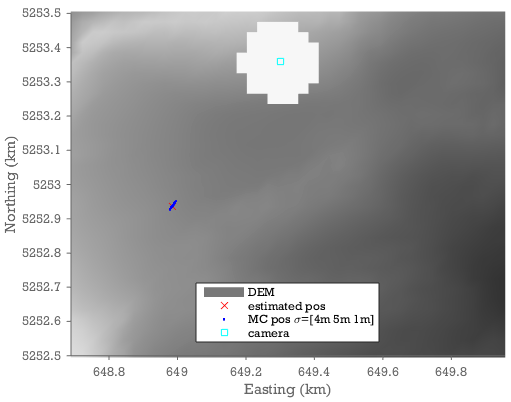

## Monte Carlo sampling of uncertainties

Monte Carlo sampling of uncertainties from different sources is a simple way to propagate uncertainties through the entire processing chain. On this page we show how you can use this approach to estimate the 3d uncertainties arising from uncertainties in the DEM and in the ground control points. The method is however, much more generally applicable and it is relatively simple to expand on this to get the uncertainties in 3d velocities given uncertainties in DEM, GCPs, camera-location, subpixel feature tracking uncertainties, etc. 
  
# MC Example: DEM & GCP uncertainties at Schneefernerkopf. 
Uncertainties in e.g. the DEM or the GCPs will propagate through the processing chain to the final estimate of the 3D position associated with a given pixel.  On this page we outline how you can use a relatively simple Monte Carlo sampling of the input uncertainties to estimate the uncertainty in the final outcome.  We start from the data and code in the Schneefernerkopf example. 

Lets say we have run the Schneefernerkopf example and now we want to know what is the position of a target pixel. 

First we run demoschneeferner which fits a model camera to the GCPs. To obtain the world coordinates of the target pixel then we would make an inverse projection (raytracing) of the pixel onto the DEM.

```matlab
demoschneeferner
pixel=[875 1394];
world=camA.invproject(pixel,X,Y,dem)
```

The question is how uncertain is the resulting world coordinate because of uncertainties in the DEM and the GCPs. Lets say that the vertical standard uncertainty is 2m in the DEM, and that the pixel uncertainties of the GCPs have a standard uncertainty of 2 pixels. In the Monte Carlo we repeat the calculation but perturb the inputs in accordance with these uncertainties and see what impact it has on the output. 

```matlab
sigmaDEM = 2; %estimated uncertainty in DEM. (m)
sigmaGCP = 2; %GCP pixel uncertainty.

mcworld=nan(1000,3); %this is where we store the monte carlo sample of 3d coordinates

%As we will perturb the dem in the monte carlo we might end up in a situation
%where the camera appears to be below the DEM. For that reason we hide the
%foreground from view by making a hole in the DEM around the camera. 
camdist=sqrt((X-camxyz(1)).^2+(Y-camxyz(2)).^2);
dem(camdist<100)=nan;

for ii=1:size(mcworld,1)
    mcgcpAuv=gcpA(:,4:5)+randn(size(gcpA,1),2)*sigmaGCP/sqrt(2);
    mccam=camA.optimizecam(gcpA(:,1:3),mcgcpAuv,'00000111110011000000');
    mcdemerror=randn*sigmaDEM;
    mcworld(ii,:)=mccam.invproject(pixel,X,Y,dem+mcdemerror,world(1:2));
    timedwaitbar(ii/length(mcworld))
end


close all
pcolor(X/1000,Y/1000,dem)
shading interp
colormap gray
hold on
h=plot(world(1)/1000,world(2)/1000,'rx',mcworld(:,1)/1000,mcworld(:,2)/1000,'b.',camxyz(1)/1000,camxyz(2)/1000,'cs')
xlabel('Easting (km)')
ylabel('Northing (km)')
axis equal 
ylim([5252.5 5253.5])
legend('DEM','estimated pos',sprintf('MC pos \\sigma=[%.0fm %.0fm %.0fm]',nanstd(mcworld)), ...
    'camera','location','south')
```




We find uncertainties of 4,6, and 1m on the x,y, and z coordinates. We can also see that the x and y uncertainties covary and the uncertainty is predominantly in the distance to the camera. 

You can use a similar MC approach to estimate the propagated uncertainties associated with:
* Uncertainties in templatematch displacements. (provided you have an estimate of how good the templatematcher works on your dataset). 
* Uncertainties in camera parameters such as the position. 
* Uncertainties in xyz position rather than the uv coordinates of the GCPs. 
etc.

This illustrates one of the benefits of ImGRAFT being a scriptable tool: It enables these sorts of approaches. 