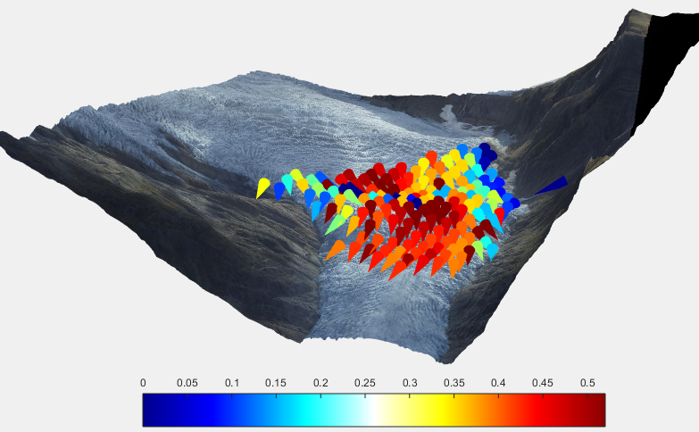

## Nice 3D plots of velocities

This example shows how you can make nice 3d plots of the output. 


In this case we show the downslope X,Y velocities from engabreen on top of the 3d terrain. In this code we show the velocities as 50m long cones coloured by velocity magnitude. Note: This code relies on the arrow3 function from the matlab filexchange.

```matlab
demoengabreen %run the engabreen example

close all
axes('pos',[0 0 1 1])
surface(dem.X,dem.Y,dem.Z,dem.rgb,'EdgeColor','none','FaceColor','texturemap');
view([-4 8 1])
hold on;
axis equal off
%h=quiver3(xyzA(keep,1),xyzA(keep,2),xyzA(keep,3)+5,Vg(keep,1)./Vgn(keep),Vg(keep,2)./Vgn(keep),Vg(keep,1)*0,'r.');
%h=quiver3(xyzA(keep,1),xyzA(keep,2),xyzA(keep,3)+5,Vg(keep,1),Vg(keep,2),Vg(keep,1)*0,'r');

from=bsxfun(@plus,xyzA(keep,:),[0 0 10]);
Vdir=bsxfun(@rdivide,Vg(keep,:)*50,Vgn(keep)); %
Vdir(:,3)=-20; %only show xy components of velocity
cmap=jet(128);
clim=[0 prctile(Vgn,90)];
caxis(clim);
colors=interp1q(linspace(clim(1),clim(2),length(cmap))',cmap,max(min(Vgn(keep),clim(2)),0)); 
colorbar('south')

for ii=1:length(from)
    h=arrow3(from(ii,:),Vdir(ii,:),[],1,[],'cone');
    set(h,'facecolor',colors(ii,:));
end
```




