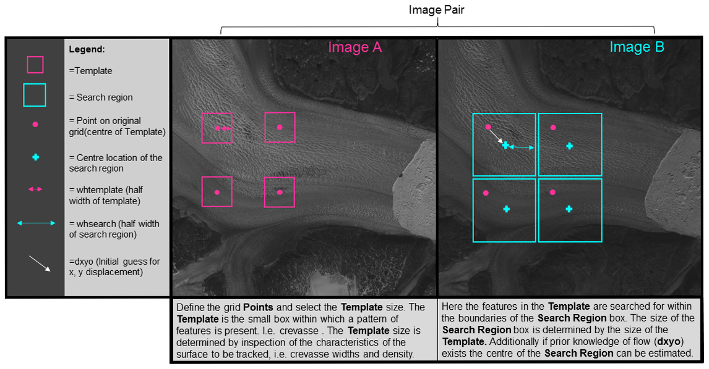

## Feature tracking by template matching 
You provide templatematch with two images (A and B) and a set of coordinates in A that should be tracked. Templatematch will then cut out small templates around each point and calculate the similarity within a search region in image B. The measure of similarity will typically be normalized cross correlation. The 'optimal' displacement xy will be returned with sub-pixel precision. 

A simple example of template matching can be found here. 

In its simplest form you can use templatematch thus:

```matlab
[du, dv, peakCorr, meanAbsCorr, pu, pv] = templatematch(A,B) 
```

Note: u,v refers to pixel coordinates in the code below.


```
USAGE:
     [du, dv, peakCorr, meanAbsCorr, pu, pv] = templatematch(A,B[,pu,pv][,parameter-value-pairs])
 
  INPUTS
     A,B: images
     pu,pv: pixel coordinates in A that should be located in B. (Default is a regular grid)
 
 
  NAMED PARAMETERS: 
     TemplateWidth,TemplateHeight: Size of templates in A (Default: 21).
     SearchWidth,SearchHeight: Size of search region in B (Default: TemplateWidth+40).
     SuperSample: super sampling factor of input images for improved subpixel accuracy. (default=1)
     Initialdu,Initialdv: initial guess of the displacement between A & B
     super: supersampling factor (input to imresize)
     ShowProgress: Boolean or cell-array of strings.
                   true (default) is used for a text progress bar.
                   A cell of strings is used to name the A & B images in a progress figure.
     Method: 'NCC'(default), 'NORMXCORR2' or 'PC' (normalized cross correlation or phase correlation)
 
  OUTPUTS:
    du,dv: displacement of each point in pu,pv. [A(pu,pv) has moved to B(pu+du,pv+dv)]
    peakCorr: correlation coefficient of the matched template. 
    meanAbsCorr: The mean absolute correlation coefficitent over the search
                 region is an estimate of the noise level.
    pu,pv: actual pixel centers of templates in A (may differ slightly from inputs because of rounding). 
```

## Coordinates of features to be tracked (pu,pv):
pu and pv are used to specify the pixel coordinates of the features in A that should be tracked. If none is specified then templatematch will drape a regular grid over the entire image.

## Template Width / Height:
The template size is controlled with the TemplateWidth/TemplateHeight input parameters. You can specify different template sizes for each row in points. There is no choice that works well in all situations and there are trade-offs to consider.

Pros of a large template size are:
* Fewer false matches as the 'fingerprint' of the feature is more unique.
* Cons of a large template size;
* Reduced resolution of output. Hi resolution is necessary for narrow outlet glaciers and more data also helps in post-processing to find erroneous results.
* Performance decreases with template size. This may be partly compensated by reducing the number of tracked points as the effective resolution is any decreased. 
* Possibly greater total shear inside the template. Shear reduces the cross correlation and thus makes it harder to recognize the feature in image B.

So I recommend considering what is the desired output resolution and then also simply looking at the image to see what template size you would expect should work. Finally i would experiment with different template sizes to find what works best in the particular situation.  

## Search region size (SearchWidth/SearchHeight):
The search region size is controlled with the SearchWidth & SearchHeight input parameters. Generally you want to make that as small as possible to minimize the probability of false matches. I recommend using SearchWidth=TemplateWidth+max_expected_displacement . Here, you want to be generous with the max_expected_displacement, so as to not exclude the possibility you may be wrong. 

Sometimes there may be an advantage to choosing an even larger search region as it allows for more accurate calculation  of the signal to noise ratio: One of the outputs is the average absolute correlation inside the search region. This is normally used as the noise level in a calculation of the signal to noise ratio. 

## Super-sampling:
You can specify a super sampling factor which will resample the template and search images in order to improve the sub-pixel precision. This super sampling factor can also be used to downsample the images (when super<1) to coarser resolution if you want to speed up the calculation at the expense of precision. This approach is used in the 'rock matching' of the Engabreen example. 

The good performance of super-sampling to achieve sub-pixel precision can be seen in Gilo and Kääb (2011).

## Initial guess of displacement (initialdu/initialdv):
The larger the search region, the greater the chances are that other features will be visually similar to the template image being sought. Therefore it is generally a good idea to reduce the search region to being as small as possible. However, at the same time the search region has to be sufficiently wide to allow for the true displacement. By providing an initial guess for the displacement then you can reduce the search window size.

Advanced TIP: you can use progressively finer scales with initial displacements taken from the preceding coarse scale matches. This approach will be similar to pyramidal approaches to feature tracking. 
Initialdu/initialdv can also be used as a mask by inserting nans at locations where 

## Showprogress
The showprogress input parameter can be used to open a window where the progress of the feature tracking can be followed as it is being done. The showprogress parameter can switch between three modes:
If showprogress is empty or false. (default) 
Do not show a progress window. This is if showprogress is empty or false.
If showprogress is a cell-array of image names/ids:
Show the two images and the tracked points as they are being matched (colored according to the quality of the match).  
if showprogress is true. Show a text progressbar on the command prompt.

## Methods
You can choose normalized cross correlation, phase correlation, and orientation correlation as a similarity measures. These measures do not allow for rotation of the template. It should, however, be relatively easy to expand with additional similarity measures. 

Orientation correlation ("OC") is the recommended choice in most cases.


# Outputs
## Displacement (du,dv)
For each point in points a "correlation" maximum within the search region is found and the corresponding displacement is returned in du,dv.  This will have the same dimensions as the du, dv inputs.

## Match quality (peakCorr, meanAbsCorr)
peakCorr is the maximum correlation coefficient found at the location of each match.  
meanAbsCorr is the average or typical correlation coefficient over the entire search window. 

The ratio peakCorr./meanAbsCorr can be interpreted as a signal-to-noise ratio and can be used to filter false matches. 


Advanced tip: Sometimes it works better to spatially smooth meanAbsCorr before evaluating the signal-to-noise ratio . 

## Pre-processing images
In some cases you may improve the feature tracking by pre-processing the images. This FAQ page has a few suggestions for how you might pre-process the images.


