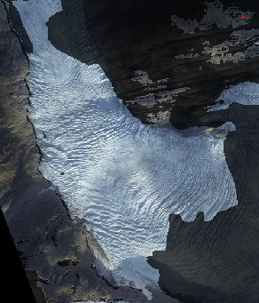

# voxelviewshed.m

voxelviewshed calculates the viewshed over a DEM. The viewshed is all the locations that are potentially visible from a given location. 


```
  USAGE: vis=voxelviewshed(X,Y,Z,camxyz)
 
  INPUTS:
  X,Y,Z: input DEM (regular grid).
  camxyz: 3-element vector specifying viewpoint.
 
  OUTPUT:
     vis: boolean visibility matrix (same size as Z)
```
## EXAMPLE:
```matlab
      [X,Y]=meshgrid(-299:300);
      Z=abs(ifft2(ifftshift((hypot(Y,X)+1e-5).^(-2.1).*exp(rand(size(X))*2i*pi)))); %example terrain inspired by rafael.pinto
      Z=(Z-Z(300,300))/std(Z(:)); camxyz=[0,0,0.5];
      vis=voxelviewshed(X,Y,Z,camxyz);
      clf;
      surf(X,Y,Z,Z.*vis-~vis*2,'EdgeColor','none','FaceColor','interp');
      hold on;
      plot3(camxyz(1),camxyz(2),camxyz(3),'k*')
      camlight
```


See also [Engabreen](demoengabreen.md) feature tracking example for an example use case. 

The algorithm is custom made and very fast. Conceptually it works by draping curtains hanging down from the DEM grid points in progressively greater circles around the camera while keeping track of visually highest 'curtain point' for every compass direction.
