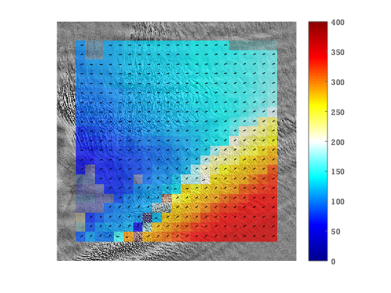

Bindschadler Ice Stream example
==========================================================

The IMCORR feature tracking software comes with two example image pairs. These are Landsat TM subscenes of a portion of Ice Stream D in West Antarctica (Now know as Bindschadler Ice Stream). This page shows how these can be tracked using the ImGRAFT toolbox.

```matlab
datafolder=downloadDemoData('imcorr');

A=imread(fullfile(datafolder,'conv_87.png'));
B=imread(fullfile(datafolder,'conv_89.png'));
dx=28.5; %m/pixel
dt=2; %years
x=(0:size(A,2)-1)*dx;
y=(size(A,2)-1:-1:0)*dx;

tic
[du,dv,C,Cnoise,pu,pv]=templatematch(A,B);
toc

%obtain corresponding map coordinates of pixel coordinates in pu,pv
px=interp1(x,pu); py=interp1(y,pv);

%display figure
close all
showimg(x,y,A)
hold on
signal2noise=C./Cnoise;
keep=(signal2noise>3.5);
V=(du-dv*1i)*dx/dt; %Using imaginary values to indicate direction (for convenience).
Vn=abs(V);
alphawarp(px,py,Vn,.2+keep*.5)
quiver(px(keep),py(keep),real(V(keep))./Vn(keep),imag(V(keep))./Vn(keep),0.2,'k') %arrows show direction.
caxis([0 400])
colorbar('eastoutside');
```

```
Elapsed time is 1.346849 seconds.

```
    

