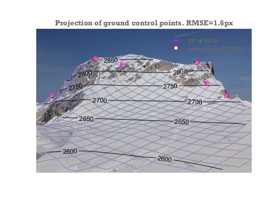

Schneefernerkopf example using data from PRACTISE
==========================================================

The PRACTISE (Photo Rectification And ClassificaTIon SoftwarE) open source package has an example data set  from Schneefernerkopf, southern Germany (supplementary data to Härer et al. 2013) . Here, we show how you can use the ImGRAFT camera model on this data set. The example data set is also attached below.

Härer, S., Bernhardt, M., Corripio, J. G., & Schulz, K. (2013). PRACTISE–Photo Rectification And ClassificaTIon SoftwarE (V. 1.0). Geoscientific Model Development

Note this example needs the matlab mapping toolbox for loading the DEM.

```matlab
close all
%load data
datafolder=downloadDemoData('practise');
A=imread(fullfile(datafolder,'ufs20110511_0815_4dot5Mpx.jpg'));
gcpA=load(fullfile(datafolder,'GCPortho6_4dot5Mpx.txt'));
load(fullfile(datafolder,'dem30m.mat'));

[X,Y]=meshgrid(x,y);

%camera location as given in practise:
camxyz=[649299.97, 5253358.26];
camxyz(3)=interp2(X,Y,dem,camxyz(1),camxyz(2),'spline')+1.5;

%initial guess camera parameters: (also from practise)
FocalLength=31; %mm
SensorSize=[22.3 14.9]; %mm
imgsz=size(A);
f=imgsz([2 1]).*(FocalLength./SensorSize);

camA=camera(camxyz,size(A),[225 0 0]*pi/180,f); %approximate look direction.

% In this example I allow the camera-z coordinate to be free because the DEM
% is only 30m resolution, and also because the viewshed appears inconsistent
% with the 1.5m elevation. I also fit a 1 parameter radial distortion model
% because AIC tells me that it is a better model.
%
% We optimize camera elevation, 3 viewdir angles, 2 focal lengths, 1 radial distortion coefficient.
[camA,rmse,aic]=camA.optimizecam(gcpA(:,1:3),gcpA(:,4:5),'00100111110010000000');
fprintf('reprojectionerror=%3.1fpx  AIC:%4.0f\n',rmse,aic)

%visualize the output
image(A)
axis equal off tight
hold on

%project the DEM onto the camera plane
[uvDEM,~,inframe]=camA.project([X(:),Y(:),dem(:)]);

%Hide DEM points that are not visible from the camera:
vis=voxelviewshed(X,Y,dem,camA.xyz);
uvDEM(~(inframe&vis(:)),:)=nan;

%show DEM as a mesh with labelled contours on top.
mesh(reshape(uvDEM(:,1),size(dem)),reshape(uvDEM(:,2),size(dem)),dem*0,'facecolor','none','edgecolor',[.7 .7 1]*.7)
[c,h]=contour(reshape(uvDEM(:,1),size(dem)),reshape(uvDEM(:,2),size(dem)),dem,[2600:50:3000],'k');
clabel(c,h)

%Show GCPs and reprojected GCPs
uvGCP=camA.project(gcpA(:,1:3));
h=plot(uvGCP(:,1),uvGCP(:,2),'ro',gcpA(:,4),gcpA(:,5),'m*','markerfacecolor','w');
legend(h([2 1]),'UV of GCP','projection of GCPs','location','northeast')
title(sprintf('Projection of ground control points. RMSE=%.1fpx',rmse))
```

```
Warning: Columns of data containing NaN values have been ignored during
interpolation. 
reprojectionerror=1.6px  AIC:  16

```
    

